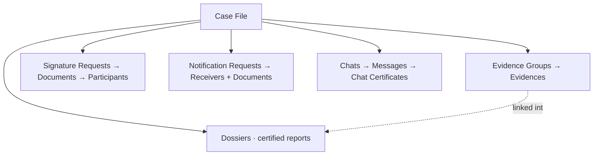
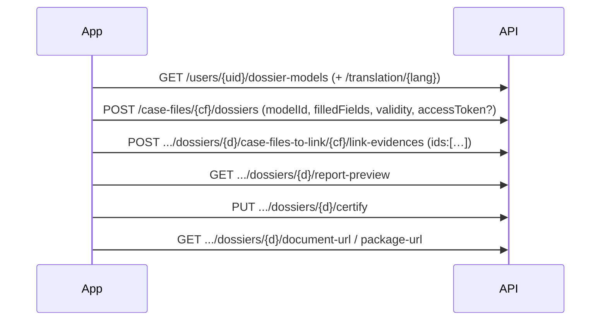
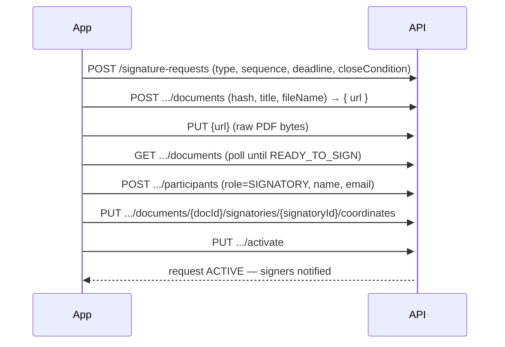

# GoCertius / EAD Enterprise Suite — API Integration Guide

> **Skill version 1.0.0 — updated 2026-07-18.** See the [Changelog](#changelog) at the end. Authentication facts are stated as of this date; the user-key endpoints are being promoted to production (see §1).

GoCertius and EAD Enterprise Suite are the **same API** behind two deployments. They share one OpenAPI contract and differ only in base URL and **which products each deployment has enabled**. Everything in this guide applies to both, but check the product table below before calling an endpoint — a resource that isn't enabled on your deployment won't work.

| Deployment | Base URL | Interactive docs |
|---|---|---|
| GoCertius | `https://api-gocertius.gocertius.io` | `https://api-gocertius.gocertius.io/apidoc/` |
| EAD Enterprise Suite | `https://api-eadcustody.eadtrust.gocertius.io` | (same OpenAPI, EAD host) |

### Products enabled per deployment

| Product | GoCertius | EAD Enterprise Suite |
|---|:---:|:---:|
| Evidence capture | ✅ | ✅ |
| Dossiers (evidence certificates) | ✅ | ✅ |
| Certified notifications | ✅ | ✅ |
| **Chats** (certified conversations) | ✅ | ❌ |
| **E-signature** | ❌ *(planned)* | ✅ |

Both deployments do evidence + dossiers + notifications. **Chats are GoCertius-only.** **E-signature is EAD-Enterprise-only** — it is not yet in GoCertius (expected in a few months). The dossier **templates also differ** (see §4): GoCertius ships one standard template; EAD Enterprise exposes editable templates.

> Fetch the live OpenAPI JSON from the `/apidoc/` Swagger UI on your base host to resolve exact field-level schemas. This guide gives you the flows, options, and traps that the raw spec does *not* make obvious.
>
> **Provenance:** items marked ✅ **Tested** were executed against the live API on 2026-07-02…18 — auth (incl. the legal-texts gate, the **user-key exchange**, and **`GET /profile`** for identity), the full evidence flow, pagination, and the **chat + chat-certificate** flow against GoCertius production; the full **dossier / evidence-certificate** lifecycle (templates, fields, password, preview, certify, download, visibility, delete, express), **e-signature** (INTERPOSITION) build + **signed-document / completion-certificate download**, and **certified notification** (email + WhatsApp) + **delivery-certificate** flows against EAD Enterprise Suite. The two deployments share one contract, so contract-level flows apply to both — but respect the per-deployment product table above. Anything without a ✅ is spec-derived.

---

## 1. Authentication

All business endpoints require `Authorization: Bearer <jwt>`. There are two supported ways to obtain that JWT:

| How | Endpoint | Session | When to use |
|---|---|---|---|
| **User key** *(recommended)* | `POST /user-keys/session` | ~24 h | Headless / server-to-server: a long-lived key, no password in config. The predominant method — see the rollout note. |
| **Password** | `POST /session` | ~1 h | Interactive logins, and to mint a user key from. Fully supported everywhere. |

> **User-key rollout (as of this guide's date, 2026-07-18).** User keys are the intended default for automated integrations and are being promoted to production imminently. **Password login is available on every host and remains fully supported** — use it for interactive sessions, and as the fallback wherever the user-key endpoints are not yet live on your target host.

**Account types.** `GET /session-info/{email}` reports an account's type (`Password` or `OpenId`). You need a **`Password`-type account** to use this API — either to log in directly, or to mint a user key from it.

> **OpenId (Azure AD) accounts cannot authenticate through this API.** The deployed OpenID clients are confidential apps whose secret is not provisioned to integrations, so there is no API-usable token exchange. If your account is `OpenId`-type, use a Password account instead — or a user key minted from one (an admin can issue the key out-of-band).

### User keys — the recommended flow (headless, no password in config)

A **user key** is a long-lived credential that you exchange for a short-lived session JWT. It is the intended way to run an integration without storing an account password, and it carries the identity and permissions of the user who minted it. **You choose its lifetime** via `expiresAt` on create — 12 months is a typical choice.

**The key is not the token.** A user key does **not** work as a `Authorization: Bearer` value on business endpoints — this is the single most common mistake. It goes in the **body** of the exchange call, and the `jwt` you get back is what you send as the Bearer:

```bash
# Exchange the long-lived key for a session JWT (no Authorization header on this call)
curl -s -X POST "$BASE/user-keys/session" \
  -H "Content-Type: application/json" \
  -d '{"key":"'"$USER_KEY"'"}'
# → 201 { "jwt": "eyJ..." }   ← session token, ~24 h, payload.sessionType = "UserKey"
```

Then use that `jwt` exactly like a password-session JWT (`Authorization: Bearer <jwt>` on every call). Cache it and re-exchange on expiry — the key itself is reusable until it expires or is revoked, so **do not call `/user-keys/session` on every request**; exchange once, reuse the JWT, and refresh shortly before its `exp`.

**A user-key session has no email of its own** — so use `GET /profile` (below), not `/session-info/{email}`, to learn who you are and get your `userId`.

**Managing keys** (these calls *are* authenticated — you need a session JWT first, so a key is always minted from a password login or an existing session):

```bash
# Create — returns the secret ONCE. Store it now; it is not retrievable later.
curl -s -X POST "$BASE/user-keys" -H "Authorization: Bearer $JWT" \
  -H "Content-Type: application/json" \
  -d '{"id":"<uuid-v4-you-generate>","name":"ci-integration","expiresAt":"2027-07-17T00:00:00.000Z"}'
# → 201 { "key": "<base64(keyId)>___<base64(secret)>" }

# List — metadata only; keyHead/keyTail are a masked fingerprint, never the full secret
curl -s "$BASE/user-keys?filter[expired]=false&page[size]=20" -H "Authorization: Bearer $JWT"
# → 200 { data:[{ id, name, keyHead, keyTail, expiresAt, createdAt }], meta:{ totalElements } }

# Revoke
curl -s -X DELETE "$BASE/user-keys/{userKeyId}" -H "Authorization: Bearer $JWT"   # → 204
```

Notes that matter:
- `id`, `name` (≤100 chars) and `expiresAt` are all **required** on create; you generate the `id` (UUID v4) client-side, as everywhere else in this API.
- The full key is returned **only** in the create response. There is no "show key" endpoint — `list` gives you `keyHead`/`keyTail` so you can identify which key a stored secret corresponds to, and nothing more. Lose it and you mint a new one.
- The key's shape (`base64(keyId)___base64(secret)`, triple underscore) is an implementation detail — treat it as an opaque string.
- Rotation: create the new key, deploy it, then `DELETE` the old one. Keys are independent, so old and new work in parallel during the switchover.
- Assume that revoking a key does **not** invalidate session JWTs already exchanged from it — the JWT is self-contained, so an issued session plausibly lives out its ~24 h. *(Inferred, not verified — if you need hard revocation, verify it against your environment first.)*

> ✅ **Tested** (2026-07-16): `POST /user-keys/session` with `{"key":"<12-month key>"}` → `201 {jwt}`; the JWT's payload carries `sessionType:"UserKey"` and an ~24 h `exp`, and it authenticates business endpoints normally as a Bearer. Presenting the **key itself** as a Bearer returns `401` — the exchange is mandatory.

### Password accounts

Fully supported everywhere, and the way to bootstrap a user key.

```
POST /session   { "email", "password" }   →   { "jwt": "..." }
```

**The legal-texts gate.** If the account hasn't accepted the current terms, `POST /session` returns **HTTP 409** with `{ "info": { "pendingLegalTextCodes": ["SERVICE_TERMS", ...] } }` instead of a JWT. Resolve it once:
```bash
# 1. fetch the current legal texts to get the id of each pending code
curl -s "$BASE/legal-texts?language=es_ES" | jq '.data[] | {code, id, version}'
# 2. log in accepting them
curl -s -X POST "$BASE/session-with-legal-texts" -H "Content-Type: application/json" -d '{
  "email":"'"$EMAIL"'", "password":"'"$PASS"'", "legalTextLanguage":"es_ES",
  "acceptServiceTermId":"<id of the SERVICE_TERMS text>"
}'   # → HTTP 201 { "jwt": "..." }
```
`acceptPrivacyPolicyId` is the analogous field if `PRIVACY_POLICY` is pending. A production JWT is a normal 3-part token; for a password session `payload.sub` carries your `userId` — but prefer `GET /profile` (below), which works on any flow.

> ✅ **Tested** (production, 2026-07-02): `GET /session-info/{email}` → `type: "Password"`; a bare `POST /session` returned `409` with `pendingLegalTextCodes:["SERVICE_TERMS"]`; `GET /legal-texts?language=es_ES` returned `.data[]` with `{code:"SERVICE_TERMS", id, version:6}`; `POST /session-with-legal-texts` with that id → `201` + JWT whose `sub` is the userId.

### Resolving your identity — `GET /profile`

Most user-scoped endpoints need your **`userId`** (a UUID) in the path — e.g. `GET /users/{userId}/case-files`. Get it from `GET /profile`, which identifies you from the session token alone:

```bash
curl -s "$BASE/profile" -H "Authorization: Bearer $JWT"
# → 200 { "id": "<userId>", "email", "companyId", "defaultCaseFileId", "loginInfo": { "type" }, ... }
```

- **`id` is your `userId`** — the value the `/users/{userId}/...` routes expect.
- Also returns `companyId` (needed to subscribe to the notifications SSE stream `/notifications/sse/{companyId}`), `defaultCaseFileId` (your personal case file — the one certified chats must use), and `loginInfo.type`.
- **Use `/profile`, not `/session-info/{email}`, to answer "who am I".** `/session-info` is keyed on an email and only reports the *account type*; it is useless on the user-key flow, which has no email. `/profile` works identically on both flows.

> ✅ **Tested**: `GET /profile` is live in **production** on both hosts (2026-07-18: `401` unauthenticated, and present in the production OpenAPI). The `id`→`userId` mapping is from the spec schema (`ShowProfileRepresentation.id`, required) and was exercised end-to-end on the user-key flow.

### Using the token
Whichever flow produced it, the JWT is used identically:

- Send `Authorization: Bearer <jwt>` on every subsequent call. Never send a *user key* here — only the exchanged JWT.
- **Get your `userId` from `GET /profile` → `id`** (above); it works on any flow. A *password*-session JWT also carries it in `payload.sub`, but **do not rely on the `sub` claim for a user-key session** — resolve identity via `/profile` instead. Several endpoints need this UUID, *not* the email — e.g. `GET /users/{userId}/case-files`, and any `ownerId` filter.
- Session lifetime: **~1 hour** for a password session, **~24 hours** for a user-key session (`payload.sessionType` tells you which: `UserKey` vs a password session). Don't hardcode either — read `payload.exp` and refresh a minute or so before it.
- Re-authenticating means repeating whichever flow you used (`POST /session` or `POST /user-keys/session`); there is no refresh-token endpoint on the GoCertius side.
- `DELETE /session` logs out.

---

## 2. The resource model

Almost everything hangs off a **Case File** (`caseFileId`) — the container for a matter/dossier of work. Under it live the product workflows:



**Every operation needs a `caseFileId`.** You don't have to *create* one each time — you need to **declare which case file the work belongs to**. Either reuse/look up an existing one or create a new one:
```
GET  /case-files                     # search/list case files (paginated — see pagination note in §3)
GET  /users/{userId}/case-files      # case files owned by a user
POST /case-files   { "id": <uuid>, "name", "useCaseId": <uuid>, "reference"?, "description"? }   # create
```
`useCaseId` is required on create and tenant-specific — list the ones your account can use via `GET /use-cases` → `{ data:[ { id, code, translations:[{name,language}] } ], meta }` (tested). Each use-case has a `code` (e.g. `PR` = "Personal"). ⚠️ The `PR`/personal use-case allows only **one** case file per account — a second create returns `422 { useCaseId:[personalCaseFileAlreadyExists] }`; use a general use-case for programmatic creation. `id` is a **client-generated UUID** (see idempotency below).

### Three conventions that apply everywhere

1. **Client-supplied UUIDs = idempotency.** Nearly every create takes an `id` (`format: uuid`) *you* generate (`crypto.randomUUID()`). Reusing the same id makes a retry idempotent instead of creating a duplicate. Always send real UUIDs — arbitrary strings are rejected.

2. **The hash + upload-url pattern for every file.** You never POST raw bytes to the JSON API. Instead:
   ```
   1. Compute sha-256 of the file — you need it in TWO encodings:
        • hex    → goes in the JSON `hash` field
        • base64 → goes in the S3 upload header (see below)
   2. POST the metadata (hash=hex, fileName, ...) → API returns a short-lived presigned { uploadFileUrl }.
   3. PUT the raw bytes to that url with header  x-amz-checksum-sha256: <base64 sha-256>
   ```
   This holds for evidences, signature documents, and notification attachments alike. **Exception:** the resumable **large-file multipart** path (see §3) takes no client hash at all — GoCertius computes the sha-256 server-side after recomposing the chunks.

   > ⚠️ **The `x-amz-checksum-sha256` header is mandatory and undocumented.** The presigned URL is signed with `SignedHeaders=host;x-amz-checksum-sha256`, so a plain `PUT` (or one with only `Content-Type`) fails with **`403 SignatureDoesNotMatch`**. The value is the **base64** sha-256 of the bytes — not the hex you put in `hash`. In shell: `openssl dgst -sha256 -binary file | openssl base64`.

3. **Async work is the norm — poll responsibly, or subscribe to events.** Sealing evidence, certifying a dossier, processing a signature document, and generating certificates are all **asynchronous** (they transition through states and typically settle in ~10–30 s). Two rules:
   - **Prefer events over polling.** For notifications, subscribe to the Server-Sent Events stream `GET /notifications/sse/{companyId}` (resume with the `Last-Event-ID` header) instead of polling status. Use polling only where no event stream exists.
   - **When you must poll, bound it.** Wait **≥5 s between attempts** (a first delay of ~3–5 s, then a fixed 5 s interval or exponential backoff capped at ~15 s), and cap total attempts — **~10–12 tries (≈60 s) is plenty** for these operations. If the state hasn't settled by then, **stop and surface a timeout / check again later** — do **not** keep looping. Never poll in a tight loop, never below ~5 s, and never fan out many concurrent polls: a hot retry loop looks like a DDoS and will get you throttled or blocked. Every "poll until …" instruction in this guide inherits these limits.

---

## 3. Evidence capture

Evidence lives in a **group** (a batch sharing a capture type). Flow:

```
1. POST /evidence-groups
      { "id":<uuid>, "caseFileId", "evidenceType":"FILE", "name", "description"? }
2. POST /evidences
      { "id":<uuid>, "caseFileId", "evidenceGroupId", "hash":<hex>, "title",
        "custodyType":"EXTERNAL", "fileName" }
3. POST /case-files/{caseFileId}/evidence-groups/{evidenceGroupId}/evidences/{id}/upload-url
      { "hash":<hex>, "fileName" }                 → { "uploadFileUrl", "expiration" }
4. PUT <uploadFileUrl>   (raw bytes) with header  x-amz-checksum-sha256: <base64 sha-256>
5. POST /case-files/{caseFileId}/evidence-groups/{evidenceGroupId}/close
      { "evidencesCount":<n>, ...device/location? }
```
Closing seals the group (`evidencesCount` must match what you added). Device and geolocation fields on `close` are optional context that strengthens the evidential value. Processing is async — poll `GET .../evidences/{id}` until `status` is `COMPLETED` (bounded polling per §2.3: every ~5 s, max ~12 attempts).

| Option | Field | Values |
|---|---|---|
| Capture type | `evidenceType` | `FILE` · `PHOTO` 🔒 · `VIDEO` 🔒 · `WEB_PLUGIN` 🔒 |
| Custody | `custodyType` | `EXTERNAL` (you hold the file) · `INTERNAL` (GoCertius custody) |

> 🔒 **`PHOTO`, `VIDEO`, and `WEB_PLUGIN` are secured capture types — a plain API integration cannot use them.** They represent captures taken *inside* the official GoCertius/Suite mobile apps or browser extension, and the API only accepts them with a valid device/app **`attestation`**. The `attestation` object (on `POST .../evidence-groups` and on `close`) is `{ "provider":"AppAttest"|"PlayIntegrity", "app":"App"|"AppPro", "token", "keyId", "assertion" }` — an Apple **App Attest** or Google **Play Integrity** token that can only be produced by the genuine signed app (also registered via `POST /app-attest/attestations`). It cannot be forged by a third-party integration, so a create/close for `PHOTO`/`VIDEO`/`WEB_PLUGIN` **is rejected without the matching attestation**. **For a server-to-server integration, use `evidenceType: "FILE"`** — it needs no attestation.

> **Large files (resumable multipart):** for multi-GB uploads use the resumable path instead of the single upload-url flow:
> ```
> 1. POST .../evidence-groups/{grp}/large-evidence-uploads
>       { "id":<uuid>, "evidenceId":<uuid>, "totalSizeMB", "title", "fileName", "capturedAt" }   ← NO hash
> 2. GET  .../large-evidence-uploads/{id}/pending-offsets            → [ { "id", "offset" }, … ]
> 3. per chunk:  GET  .../pending-offsets/{offsetId}/upload-url      → presigned url
>                PUT  <url>  (the chunk bytes)
>                PUT  .../pending-offsets/{offsetId}/uploaded        (no body — marks the chunk done)
> 4. repeat until pending-offsets is empty
> ```
> ⚠️ **Do NOT compute or send a sha-256 for the large-file path.** Unlike the simple `upload-url` flow (§2), the multipart path takes **no `hash` and no `x-amz-checksum-sha256`** — GoCertius/Suite computes the sha-256 **server-side, after all chunks are uploaded and the file is recomposed**. You only supply `totalSizeMB` and upload chunks by offset. Prefer the simple upload-url flow for normal-sized files.

### Tested end-to-end walkthrough (curl)

> ✅ Executed against production `https://api-gocertius.gocertius.io` on 2026-07-02; every status below is a real response. `$JWT` is the token from §1, `$UC` a `useCaseId` from `GET /use-cases`.

```bash
BASE=https://api-gocertius.gocertius.io
CF=$(uuidgen|tr A-Z a-z); GRP=$(uuidgen|tr A-Z a-z); EV=$(uuidgen|tr A-Z a-z)
HEX=$(shasum -a 256 file.txt | awk '{print $1}')                 # → JSON `hash`
B64=$(openssl dgst -sha256 -binary file.txt | openssl base64)    # → S3 checksum header

# 1) case file (201).  NOTE: some use-cases require `description` even though the
#    base schema marks it optional — omit it and you get 422 { description:[isDefined] }.
curl -s -X POST "$BASE/case-files" -H "Authorization: Bearer $JWT" -H "Content-Type: application/json" \
  -d "{\"id\":\"$CF\",\"name\":\"demo\",\"description\":\"demo\",\"useCaseId\":\"$UC\"}"

# 2) evidence group (201)
curl -s -X POST "$BASE/evidence-groups" -H "Authorization: Bearer $JWT" -H "Content-Type: application/json" \
  -d "{\"id\":\"$GRP\",\"caseFileId\":\"$CF\",\"evidenceType\":\"FILE\",\"name\":\"grp\"}"

# 3) register evidence (202)
curl -s -X POST "$BASE/evidences" -H "Authorization: Bearer $JWT" -H "Content-Type: application/json" \
  -d "{\"id\":\"$EV\",\"caseFileId\":\"$CF\",\"evidenceGroupId\":\"$GRP\",\"hash\":\"$HEX\",\"title\":\"ev\",\"custodyType\":\"EXTERNAL\",\"fileName\":\"file.txt\"}"

# 4) presigned upload url (201) → { uploadFileUrl, expiration }
URL=$(curl -s -X POST "$BASE/case-files/$CF/evidence-groups/$GRP/evidences/$EV/upload-url" \
  -H "Authorization: Bearer $JWT" -H "Content-Type: application/json" \
  -d "{\"hash\":\"$HEX\",\"fileName\":\"file.txt\"}" | jq -r .uploadFileUrl)

# 5) upload bytes (200) — the checksum header is what makes S3 accept it
curl -s -X PUT -T file.txt -H "x-amz-checksum-sha256: $B64" "$URL"

# 6) close the group (202)
curl -s -X POST "$BASE/case-files/$CF/evidence-groups/$GRP/close" \
  -H "Authorization: Bearer $JWT" -H "Content-Type: application/json" -d '{"evidencesCount":1}'

# 7) poll until sealed → { "status": "COMPLETED", ... }.  Bounded: sleep 5s, stop after ~12 tries.
curl -s "$BASE/case-files/$CF/evidence-groups/$GRP/evidences/$EV" -H "Authorization: Bearer $JWT" | jq .status
```

**Pagination gotcha (tested):** list endpoints use bracketed, **1-based** paging — `?page[number]=1&page[size]=20` (curl needs `-g` to keep the brackets). Flat `?page=1&size=20` fails with `{ "page":[{"error":"nestedValidation"}] }`. Responses are shaped `{ "data": [...], "meta": { "totalElements": N } }`.

**The same upload, in TypeScript** (steps 4–5 — the reusable part). The dual-encoding hashing below is verified to produce byte-identical hex/base64 to the tested `openssl`/`shasum` commands:

```ts
import { createHash } from "node:crypto";
import { readFile } from "node:fs/promises";

async function uploadEvidenceFile(opts: {
  base: string; jwt: string; caseFileId: string; groupId: string; evidenceId: string; filePath: string; fileName: string;
}) {
  const bytes = await readFile(opts.filePath);
  const digest = createHash("sha256").update(bytes).digest();
  const hex = digest.toString("hex");        // → JSON `hash`
  const b64 = digest.toString("base64");     // → x-amz-checksum-sha256

  const auth = { Authorization: `Bearer ${opts.jwt}`, "Content-Type": "application/json" };

  const { uploadFileUrl } = await fetch(
    `${opts.base}/case-files/${opts.caseFileId}/evidence-groups/${opts.groupId}/evidences/${opts.evidenceId}/upload-url`,
    { method: "POST", headers: auth, body: JSON.stringify({ hash: hex, fileName: opts.fileName }) },
  ).then((r) => r.json());

  const put = await fetch(uploadFileUrl, {
    method: "PUT",
    headers: { "x-amz-checksum-sha256": b64 }, // ← without this: 403 SignatureDoesNotMatch
    body: bytes,
  });
  if (!put.ok) throw new Error(`S3 upload failed: ${put.status}`);
}
```

---

## 4. Dossiers (evidence certificates)

A **dossier** ("certificado de evidencia") binds one or more sealed evidences into a certified, timestamped PDF report built from a **template model**, optionally protected by a password and published on a public page. This is the richest workflow in the API.

### Step 0 — check the template is enabled (and read its fields)

A dossier is always built from a template model. Which models exist depends on the deployment and the account:
```
GET /users/{userId}/dossier-models
    → { "data":[ { "id", "index", "certificateLanguages":[…], "translations":[{name,language}] } ], "meta" }
GET /users/{userId}/dossier-models/{modelId}/translation/{language}
    → { "name", "description", "certificateLanguages":[…], "fields":[ { "attribute","type","name","helper","defaultValue" } ] }
```
- If `data` is empty, the account has **no editable template enabled** — dossier creation with a model won't work; get the template enabled first.
- **GoCertius** ships a single standard model (e.g. "Certificado", no fields). **EAD Enterprise** exposes editable models (e.g. "General", and "General con datos del solicitante" which requires `companyName` + `companyTaxId`).
- The `translation/{language}` call is how you discover (a) the languages a model can certify in (`certificateLanguages`) and (b) the **fields the template requires** (`fields[]`). `type` is `SimpleText` or `RichText`. **Not every model has fields** — many return `fields: []`.

### The normal flow



```
1. POST /case-files/{caseFileId}/dossiers
      { "id":<uuid>, "modelId", "name", "language":"es_ES",
        "validityFrom", "validityTo",
        "filledFields": { "<attribute>": "<value>", … },   # required iff the model declares fields
        "accessToken": "<password>" }                       # optional public-page password
2. GET  .../dossiers/{dossierId}/case-files-to-link/{caseFileId}/evidences-to-link   # candidate sealed evidences
   POST .../dossiers/{dossierId}/case-files-to-link/{caseFileId}/link-evidences  { "ids":[ <evidenceId>, … ] }
3. GET  .../dossiers/{dossierId}/report-preview     # OPTIONAL — returns { "reportPreview": "<!DOCTYPE html>…" } to sanity-check before issuing
4. PUT  .../dossiers/{dossierId}/certify            # async → poll GET .../dossiers/{dossierId} until status CERTIFIED (bounded — see §2.3)
5. GET  .../dossiers/{dossierId}/document-url       → { "url" }  the certified PDF
   GET  .../dossiers/{dossierId}/package-url        → { "url" }  full package (PDF + evidence files, ZIP)
```

**Options & rules (tested):**
- **Evidences must be sealed first.** Only evidences whose group is `CLOSED`/`COMPLETED` appear in `evidences-to-link`; the `ids` you link are the evidence ids. You can call `link-evidences` multiple times (even across case files — vary `caseFileToLinkId`).
- **`filledFields`** must supply every field the model declares (`422 { filledFields.<attr>:[isNotEmpty] }` otherwise). Omit entirely for fieldless models.
- **`accessToken`** (the public-page password) is optional but **pattern-validated**: **min 8 chars, and must contain upper + lower + digit** (e.g. `Abcd1234`). Digits-only, letters-only, or missing a class → `422 { accessToken:[matches] / [minLength] }`.
- **`validityFrom`/`validityTo`** define the availability window of the public page.
- **`report-preview`** returns a full HTML document under `reportPreview` — render it to verify layout/fields before the irreversible `certify`. Purely optional.
- **`certify` is async**: `DRAFT → CERTIFYING → CERTIFIED` (~10 s). Poll per §2.3 (every ~5 s, max ~12 tries); download URLs only work once `CERTIFIED`.
- **Edits** (`PUT .../dossiers/{id}`) are allowed only while `DRAFT`.

### Express (create + certify in one call)

```
POST /case-files/{caseFileId}/evidence-groups/{evidenceGroupId}/dossier-express
     { "id":<uuid>, "modelId"?, "evidenceIds":[…], "name", "language" }   → dossier goes straight to CERTIFYING
```
Express skips the link/preview steps. ⚠️ **The default template differs by deployment:**
- **GoCertius** — omitting `modelId` uses the built-in **standard** template.
- **EAD Enterprise** — there is no standard default: omitting `modelId` returns **`403 Forbidden`**. You must pass a `modelId` of an **editable** template (and its `filledFields` if it declares any). `dossier-group-certify` / `.../evidence-groups/{id}/dossier-express` are the express entry points.

### After issuing

Once `CERTIFIED`:
- **Deactivate the public page:** `PUT .../dossiers/{dossierId}/visibility { "visibility":"RECALLED" }` (values: `ACCESSIBLE` · `PENDING_RECALL` · `RECALLED`). Returns `204`.
- **Delete:** `DELETE .../dossiers/{dossierId}` (works in `DRAFT` to discard, or `CERTIFIED` to permanently remove — irreversible). Returns `204`.
- **Share externally:** the public page lives under `/public/dossiers/{dossierId}/…` (the viewer supplies the `accessToken` password).

> ✅ **Tested end-to-end** against EAD Enterprise Suite (2026-07-06): read `dossier-models` + `translation/es_ES` (model "General con datos del solicitante" → fields `companyName`,`companyTaxId`) → create dossier with `filledFields` + `accessToken:"Abcd1234"` (201) → `link-evidences` (201, linked count 1) → `report-preview` (200, `reportPreview` = `<!DOCTYPE html>…`) → `certify` (202) → polled `CERTIFYING → CERTIFIED` → `document-url` PDF (~861 KB) + `package-url` ZIP (~826 KB) → `visibility RECALLED` (204) → `DELETE` (204, then `GET` 404). Express confirmed: fieldless editable model → `201 → CERTIFIED`; no-`modelId` express on EAD → `403`.

---

## 5. E-signature

> **Deployment scope:** E-signature is **EAD Enterprise Suite only** today. It is not yet enabled on GoCertius (planned for a future release). Calling these endpoints on the GoCertius host will not work until then.

This is the most stateful workflow. Build the request, attach documents (upload bytes), add people, place signatures, **then** activate. You cannot activate an incomplete request.



### Step order
```
1. POST /case-files/{caseFileId}/signature-requests
      { "id":<uuid>, "name", "language":"es_ES", "deadline",
        "signatureType":"ADVANCED", "sequence":"PARALLEL",
        "closeCondition":"ALL_REQUIRED", "dashboardUrl":"NONE", "objectiveId"? }
2. POST .../signature-requests/{requestId}/documents
      { "id", "hash", "title", "fileName", "convertToPdf"?, "fileSize"? }   → { "url" }
3. PUT <url>   (raw PDF bytes)
4. GET  .../signature-requests/{requestId}/documents   ← poll until each document status is READY_TO_SIGN (bounded — see §2.3)
5. POST .../signature-requests/{requestId}/participants
      { "id", "role":"SIGNATORY", "firstName", "lastName", "email",
        "phonePrefix":"+34"?, "phoneNumber"?, "linkToAllDocuments"? }
6. GET  .../documents/{documentId}/signatories        ← read the signatoryId assigned to each signer
7. PUT  .../documents/{documentId}/signatories/{signatoryId}/coordinates
      { "coordinates":[ { "page":1, "x":30, "y":230 } ] }
8. PUT  .../signature-requests/{requestId}/activate
```

### Options
| Choice | Field | Values | Notes |
|---|---|---|---|
| Signature level | `signatureType` | `ADVANCED` · `INTERPOSITION` | `ADVANCED` = advanced e-signature. `INTERPOSITION` = the platform interposes (e.g. WhatsApp delivery of the sign link). |
| Signing order | `sequence` | `PARALLEL` · `CONFIGURABLE` | `PARALLEL` = everyone signs at once. `CONFIGURABLE` = ordered/grouped; use `.../groups` and per-signatory sequence. |
| Completion rule | `closeCondition` | `ALL_REQUIRED` · `PARTIAL_ALLOWED` | Whether every signer must sign for the request to close. |
| Signer dashboard | `dashboardUrl` | `NONE` · `ANONYMIZED` | Whether signers receive an url to a co-signer dashboard. |
| Language | `language` | `en_GB` · `es_ES` | |
| Participant role | `role` | `SIGNATORY` · `OBSERVER` · `VALIDATOR` | Observers get read access; validators approve a signatory before they can sign (`.../signatories/{id}/validators`). |

### `convertToPdf` — only for Word documents

`convertToPdf` (a boolean on the add-document call / the MCP add-document tool) has **one specific job: transform an uploaded Microsoft Word document (`.doc`/`.docx`) into a PDF** so signatures can be placed on it.

- **Set `convertToPdf: true` *only* when the file you upload is a Word document.** The backend converts it to PDF during document processing; the resulting PDF is what gets signed and is downloadable via `GET .../documents/{documentId}/converted-download-url` (the original Word file stays at `.../download-url`).
- **For a PDF you already have (or any non-Word file), leave it `false`/omit it** — no conversion happens; you upload the PDF bytes directly.
- Either way, signature coordinates and `READY_TO_SIGN` apply to the PDF: with `convertToPdf`, wait for the conversion to finish (it's part of the async processing) before setting coordinates and activating.

### Gotchas that will bite you
- **Read `signatoryId` from the document, don't assume it.** After adding a participant, the per-document `signatoryId` used by coordinates/validators comes from `GET .../documents/{documentId}/signatories` — read it there.
- **Coordinates are mandatory before activation.** Every signatory needs at least one `{page,x,y}` placement or `activate` fails.
- **Poll for `READY_TO_SIGN`.** Documents are processed async after upload (~30 s for small PDFs). Activating too early fails. Poll per §2.3 (every ~5 s, cap ~12 tries) — don't tight-loop.
- **Deadline ceiling 31 days.** A `deadline` more than 31 days out is rejected. Send an ISO datetime within range.
- **`phonePrefix` needs the `+`** (e.g. `"+34"`, not `"34"`) — otherwise the participant is flagged invalid.
- **WhatsApp delivery only applies to `INTERPOSITION`.** It silently no-ops on `ADVANCED`.
- **Document upload uses the same S3 checksum header** as evidence (§2) — `x-amz-checksum-sha256: <base64 sha-256>` on the `PUT`, or `403 SignatureDoesNotMatch`. The document must be a valid PDF for coordinate placement.
- Manage a live request with `.../resend`, `.../cancel`, `.../close`; fetch outputs from `.../documents/{documentId}/signed-document-url` and `.../documents/{documentId}/certificates/...`.

> ✅ **Tested end-to-end** against EAD Enterprise Suite on 2026-07-02, `INTERPOSITION` type: `POST /signature-requests` (201) → `POST .../documents` (201, returns `{url}`) → `PUT` PDF with `x-amz-checksum-sha256` (200) → poll `GET .../documents` until `READY_TO_SIGN` → `POST .../participants` role `SIGNATORY` (201) → read `signatoryId` from `GET .../documents/{doc}/signatories` → `PUT .../signatories/{signatoryId}/coordinates` `{"coordinates":[{"page":1,"x":30,"y":230}]}` (200) → `PUT .../activate` (200). Final request `status: ACTIVE`; the sign link was delivered by email + WhatsApp.

### Retrieving signed outputs (tested)

Once every signer has signed, the request reaches `status: COMPLETED` and each document is `SIGNED`. All output links are `GET`s returning `{ url }` (the file lives on object storage — download with a plain unauthenticated GET):
```
GET .../documents/{documentId}/signed-document-url            → { signedDocumentUrl }  # the signed PDF
GET .../documents/{documentId}/certificates/document-url      → { documentUrl }         # completion certificate (PDF)
GET .../documents/{documentId}/certificates/package-url       → { packageUrl }          # full evidential package (ZIP)
GET .../documents/{documentId}/certificates/signatures-url    → { signaturesUrl }
```
> ✅ Tested 2026-07-03 against a `COMPLETED` request: `signed-document-url` → `application/pdf` (~590 KB); `certificates/document-url` (completion certificate) → `application/pdf` (~893 KB); `certificates/package-url` → ZIP (~1.5 MB). Note the field names differ per endpoint (`signedDocumentUrl`, `documentUrl`, `packageUrl`, `signaturesUrl`). These return an error until the document is actually `SIGNED` — a signed document does not exist while the request is still `ACTIVE`.

---

## 6. Notifications (certified delivery)

Certified delivery of a document/message to one or more receivers, with a delivery certificate.

```
1. POST /case-files/{caseFileId}/notification-requests
      { "id":<uuid>, "subject", "content", "language":"es_ES",
        "type":"RECEIVED_AGREE", "otpByDefault"?, "sendWaUrlByDefault"? }
2. POST .../notification-requests/{id}/receivers
      { "id":<uuid>, "firstName", "lastName", "email",
        "phonePrefix":"+34"?, "phoneNumber"?, "otpRequired"?, "sendWaUrl"? }
      (bulk: POST .../receivers/massive)
3. POST .../notification-requests/{id}/documents
      { "id":<uuid>, "fileName", "hash", "fileSize"? }   → { "url" }
   PUT <url>   (raw bytes)
4. PUT  .../notification-requests/{id}/send      (use /send — /activate is deprecated in the API docs)
5. GET  .../receivers/{receiverId}/certificates  → delivery evidence
```

| Option | Field | Values |
|---|---|---|
| Response mode | `type` | `NO_RESPONSE` · `ACCEPTED_OR_NOT` · `RECEIVED_AGREE` |
| Language | `language` | `en_GB` · `es_ES` |
| Per-receiver OTP | `otpRequired` / `otpByDefault` | boolean |
| WhatsApp link | `sendWaUrl` / `sendWaUrlByDefault` | boolean |

Same UUID + `phonePrefix "+"` rules as signatures apply.

> ⚠️ **`content` MUST be HTML.** Plain text is accepted by the API (the send even reports `SENT`) but **does not render** on the recipient's landing page. Only a small tag set is supported: `<p>`, `<strong>`, `<em>`, `<ul><li>`, `<ol><li>` — no other tags, no CSS. Also keep `subject` to plain ASCII: avoid em dashes and smart quotes (use `-` and straight quotes).

> 📡 **Track delivery via SSE, not polling.** Subscribe to `GET /notifications/sse/{companyId}` (Server-Sent Events; resume after a drop with the `Last-Event-ID` header) to receive status transitions as they happen instead of polling `notification-requests/{id}`. If you have no way to consume SSE, fall back to bounded polling per §2.3 (every ~5 s, cap ~12 tries).

### Tested end-to-end walkthrough (curl)

> ✅ Executed against EAD Enterprise Suite (`https://api-eadcustody.eadtrust.gocertius.io`, same shared API) on 2026-07-02 — real certified delivery to an email + WhatsApp number. Each status is a real response.

```bash
BASE=https://api-eadcustody.eadtrust.gocertius.io   # or https://api-gocertius.gocertius.io
CF=<caseFileId>; NR=$(uuidgen|tr A-Z a-z); RC=$(uuidgen|tr A-Z a-z)
HTML='<p>Hola,</p><p>Prueba de <strong>entrega certificada</strong>.</p><ul><li>Email</li><li>WhatsApp</li></ul>'

# 1) create request (201) — content is HTML
curl -s -X POST "$BASE/case-files/$CF/notification-requests" -H "Authorization: Bearer $JWT" -H "Content-Type: application/json" \
  -d "{\"id\":\"$NR\",\"subject\":\"Prueba certificada\",\"content\":\"$HTML\",\"language\":\"es_ES\",\"type\":\"NO_RESPONSE\"}"

# 2) add receiver (201) — email + WhatsApp (sendWaUrl:true, phonePrefix WITH the +)
curl -s -X POST "$BASE/case-files/$CF/notification-requests/$NR/receivers" -H "Authorization: Bearer $JWT" -H "Content-Type: application/json" \
  -d "{\"id\":\"$RC\",\"firstName\":\"Hugo\",\"lastName\":\"Alonso\",\"email\":\"user@example.com\",\"phonePrefix\":\"+34\",\"phoneNumber\":\"600000000\",\"sendWaUrl\":true,\"otpRequired\":false}"

# 3) send (200)
curl -s -X PUT "$BASE/case-files/$CF/notification-requests/$NR/send" -H "Authorization: Bearer $JWT"

# 4) verify (status → "SENT", sentAt populated) — prefer the SSE stream over re-polling this
curl -s "$BASE/case-files/$CF/notification-requests/$NR" -H "Authorization: Bearer $JWT" | jq '{status, sentAt}'
```
(Attaching a document — step 3 in the sequence above — is optional; the receiver + `sendWaUrl` are what drive email/WhatsApp delivery.)

> ⚠️ **Attachment ordering (tested).** If you attach a document, you must **add the document *before* the receivers** and **wait until its status is `READY_TO_SEND`** before calling `/send`. Attaching after receivers, or sending while the document is still `PENDING`, fails with `409/404 NOTIFICATION_NOT_FOUND`. Notification documents use the same `hash → {url} → PUT + x-amz-checksum-sha256` upload as everything else. Poll `GET .../notification-requests/{id}/documents` (status `PENDING → READY_TO_SEND`, ~8 s) with bounded retries per §2.3.

### Delivery certificates (tested)

Each receiver gets a certificate proving delivery/read. Generate it after the request is `SENT` (or a later read/answer state), then download:
```
POST /case-files/{cf}/notification-requests/{nr}/receivers/{rc}/certificates   { "id":<uuid>, "language":"es_ES" }   (201)
GET  .../certificates/{certId}/document-url   → { "url" }   # the certificate PDF  ("sin anexos")
GET  .../certificates/{certId}/package-url    → { "url" }   # ZIP: certificate + annex previews  ("con anexos")
```
> ✅ Tested 2026-07-02/03: `document-url` returns the certificate as `application/pdf`; `package-url` returns a ZIP that **bundles the notification's attachments** — this is the "with vs without attachment preview" distinction (there is no separate preview flag; the *package* carries the annexes, the *document* is the certificate alone). Certificate generation is async — the first `document-url` call may 404/return empty; poll a few times per §2.3 (don't hammer). Notification status vocabulary: `CREATING → DRAFT → IN_PROCESS → SENT → PARTIALLY_READ → FULLY_READ → PARTIALLY_ANSWERED → FULLY_ANSWERED`; don't request a certificate before `SENT`.

---

## 7. Chats (certified conversations)

> **Deployment scope:** Chats are **GoCertius only** — this product is not enabled on EAD Enterprise Suite.

A **chat** captures a conversation (Telegram-backed) under a case file and lets you emit a certified PDF of a message range.

```
1. POST /case-files/{cf}/chats
      { "id":<uuid>, "title", "service":"Telegram", "language":"es_ES", "serviceTitle"?, "serviceDescription"? }   (201)
2. GET  /case-files/{cf}/chats/{chatId}/invitation-url     # link to invite participants (available once the Telegram channel is provisioned)
3. …participants join and exchange messages (GET .../messages, GET .../participants)…
4. POST /case-files/{cf}/chats/{chatId}/certificates
      { "id":<uuid>, "modelId", "name", "language":"es_ES",
        "validityFrom", "validityTo", "chatMessagesFrom", "chatMessagesTo" }   (201)
5. PUT  .../chats/{chatId}/certificates/{certId}/certify    (202)
6. GET  .../chats/{chatId}/certificates/{certId}/document-url   → { "url" }   # certificate PDF
   GET  .../chats/{chatId}/certificates/{certId}/package-url    → { "url" }   # full package (ZIP)
```
- `modelId` comes from `GET /users/{userId}/chat-certificate-models`.
- `service` currently only accepts `Telegram`.
- ⚠️ **`chatMessagesFrom` must be ≥ the chat's `registeredAt`** (you can't request messages from before the chat existed) — otherwise `422 { chatMessagesFrom:[lessThan registeredAt] }`. Read `registeredAt` from `GET .../chats/{chatId}` and use it as the range start; `chatMessagesTo` can be "now".
- After `certify`, poll `document-url`/the certificate status until `CERTIFIED` per §2.3 (every ~5 s, cap ~12 tries).

> ✅ **Tested end-to-end** (GoCertius, 2026-07-03): create chat (201) → create certificate with `chatMessagesFrom = registeredAt` (201) → `certify` (202) → poll `document-url` (ready in ~8 s, `status: CERTIFIED`) → downloaded the certificate PDF (`application/pdf`, ~2 MB) and the package ZIP (~2 MB). `invitation-url` returns `404 "Chat not found"` until the Telegram channel is provisioned — retry once the chat has participants.

---

## 8. Quick reference

**Base paths:** all business resources are nested under `/case-files/{caseFileId}/...`. Public (unauthenticated, share-link) reads live under `/public/...`.

**Auth (§1):** **User key (recommended):** `POST /user-keys/session` `{key}` → `{jwt}` (~24 h) — the key goes in the **body of the exchange**, never as a Bearer. **Password:** `POST /session` (email+password, ~1 h). Always `Authorization: Bearer <jwt>` afterwards. **Get your `userId` from `GET /profile` → `id`** (works on any flow; don't trust `payload.sub` on a user-key session); `payload.exp` drives refresh. Key lifecycle: `POST /user-keys` (secret shown once) · `GET /user-keys` (masked) · `DELETE /user-keys/{userKeyId}`. OpenId accounts can't authenticate via this API.

**Global patterns:** client UUID for idempotency · hash → upload-url → PUT bytes for files · build-then-activate for signature & notification requests · **async everywhere → prefer SSE, otherwise bounded polling (≥5 s interval, ~12 attempts max, then stop)**.

**Async / polling discipline (§2.3):** never poll faster than ~5 s or in a tight loop; cap total attempts (~60 s) and surface a timeout rather than hammering; subscribe to `GET /notifications/sse/{companyId}` (with `Last-Event-ID`) for notification events instead of polling.

**Outputs:** downloadable artefacts (signed docs, certificates, packages) are always a `GET …-url` returning `{ url }` to unauthenticated object storage — `document-url`/`signed-document-url` = a PDF, `package-url` = a ZIP bundling annexes. Certificate generation is async; poll the `-url` endpoint until it returns (bounded).

**Enum cheat-sheet:**
- Evidence type: `FILE` `PHOTO` `VIDEO` `WEB_PLUGIN` · Custody: `INTERNAL` `EXTERNAL`
- Dossier status: `DRAFT` `CERTIFYING` `CERTIFIED` · visibility: `ACCESSIBLE` `PENDING_RECALL` `RECALLED` · field type: `SimpleText` `RichText` · password `accessToken`: ≥8 chars, upper+lower+digit
- Signature type: `ADVANCED` `INTERPOSITION` · Sequence: `PARALLEL` `CONFIGURABLE` · Close: `ALL_REQUIRED` `PARTIAL_ALLOWED` · Role: `SIGNATORY` `OBSERVER` `VALIDATOR` · Request status: `DRAFT` `ACTIVE` `COMPLETED` (doc: `READY_TO_SIGN` `SIGNED`) · deadline ≤ 31 days
- Notification type: `NO_RESPONSE` `ACCEPTED_OR_NOT` `RECEIVED_AGREE` · status: `CREATING` `DRAFT` `IN_PROCESS` `SENT` `PARTIALLY_READ` `FULLY_READ` `PARTIALLY_ANSWERED` `FULLY_ANSWERED` · doc: `PENDING` `READY_TO_SEND` · send via `/send` (`/activate` deprecated)
- Chat service: `Telegram` · chat certificate status: `CERTIFIED`
- Languages: `en_GB` `es_ES` (`pt_PT` for dossiers)

**Related:** EAD Factory is a *different* product/API (host `gcloudfactory.com`, four manager specs, external bearer token) — see the `ead-factory-api` skill.

---

## Changelog

- **1.0.0 — 2026-07-18.** First versioned/dated release. Authentication reworked: **user keys are now the recommended, predominant flow** (production rollout in progress) with password login kept as a fully supported alternative. Added **`GET /profile`** as the canonical way to resolve your `userId` (its `id`) on any flow — and corrected the previous guidance that read `userId` from the JWT `sub` claim, which is unreliable for user-key sessions. **Removed all OpenID access instructions** (device-code / `POST /openid/session` how-to); OpenID now appears only as a two-line note that such accounts cannot authenticate via this API. *(Context: user-key auth shipped in the MCP packages GoCertius v1.5.0 / EAD Enterprise Suite v1.6.0; this skill documents the underlying REST API and is versioned independently.)*
